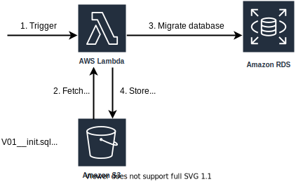

# Flyway AWS Lambda Function

**Run Flyway database migrations as a Lambda function.**

> ℹ️ This fork of the (seemingly abandoned) [flyway-awslambda](crossroad0201/flyway-awslambda) project introduces 
>the following improvements:
>* Flyway can be configured via the [officially supported environment variables](https://flywaydb.org/documentation/envvars) *(only config file was supported before)*
>* **All** Flyway configuration options are supported *(only a small subset was supported before)*
>* Upgrade Flyway to version 6 *(was 4)*
>* Improved documentation and examples
>
>Other than possible breaking changes between Flyway 4 vs. 6 (I couldn't identify any) the Lambda function itself is 
>100% backwards compatible with the original project, i.e. the JAR can be put in place of the old function without breaking changes.

## How it works


1. The Lambda function is triggered either
    * by invoking it manually
    * or automatically when a file is uploaded into an S3 bucket
2. The migration scripts are loaded from the bucket
3. The migrations are performed on the database
4. A file containing the migration results is pushed to the bucket

## Setup
> ℹ️ *CloudFormation samples can be found under `./src/main/aws/`. Read on for the manual setup.* 

First, create a new Lambda function and upload the flyway-awslambda-x.y.z.jar file as code. You can either download a pre-built
JAR file from the releases or build it yourself (Scala is required):

```
sbt assembly
```

### Settings

* **Runtime:** *Java 8*
* **Handler:** 
    * "crossroad0201.aws.flywaylambda.S3EventMigrationHandler" if the Lambda should be triggered when a file is uploaded to the bucket
    * "crossroad0201.aws.flywaylambda.InvokeMigrationHandler" if you wish to invoke the Lambda manually
* **Role:** 
    * AmazonRDSFullAccess
    * AmazonS3FullAccess
    * AWSLambdaVPCAccessExecutionRole
* **VPC:** *Same VPC as the target RDS*

### Triggers (in case of S3EventMigrationHandler)

| |Value
|----|----
|Bucket|Your Flyway migration bucket, e.g. "my-flyway"
|Event type|`Object created`
|Prefix|The Flyway migration files location, e.g. "my-application/"
|Suffix|`sql`

### Bucket Structure
The Lambda function expects the S3 bucket to be structured like this:

```
s3://my-flyway             <- Flyway migration bucket.
  - /my-application        <- Flyway resource folder(prefix).
    - flyway.conf          <- Flyway configuration file (optional)
    - V1__create_foo.sql   <- SQL file(s)
    - V2__create_bar.sql
```

## Running the Lambda
### Using the S3EventMigrationHandler

* Put the Flyway SQL files into the migration folder (**one by one!**).
* The Lambda function is invoked automatically by an S3 event.
* Check `migration-result.json` in the S3 bucket for the results or CloudWatch logs for more detail.

### Using the InvokeMigrationHandler

* Put the Flyway SQL files into the migration folder
* Invoke the Lambda function manually with the following JSON payload.
(invoke by AWS console, CLI, any application...etc. see [CLI example](./invoke_flywaylambda.sh))

```json
{
  "bucket_name": "my-flyway",
  "prefix": "my-application",
  "flyway_conf": "flyway.conf"  // Optional. Default 'flyway.conf'
}
```

* Check `migration-result.json` in the S3 bucket for the results or CloudWatch logs for more detail.

## Configuration
The Lambda function can be configured either by way of a Flyway **configuration file** in the S3 bucket (1) or with 
**environment variables** (2). In case no configuration file is found it is assumed that the function should be configured 
via environment variables. Please note that the configuration method is a binary choice -- you can only pick one.

1. **Configuration file**: For this configuration method place a [Flyway compliant config file](https://flywaydb.org/documentation/configfiles) 
in the application folder along with the migration scrips.

2. **Environment variables**: To configure the Lambda function via env vars it is crucial that no config 
file is present in the bucket. The Lambda function passes the `FLYWAY_*` env vars directly through to the library. See 
[the official documentation](https://flywaydb.org/documentation/envvars) for a list of supported env vars.


## Supported Databases
Only MySQL is supported out of the box. If another database is used it is recommended to make use of [Lambda Layers](https://docs.aws.amazon.com/lambda/latest/dg/configuration-layers.html).

Here's how to:
* Download the desired database driver's JAR file
* Zip the JAR such that the jar is located in the java/lib folder, e.g. `java/lib/postgresql-42.2.6.jre7`
* Create the Lambda layer (select the "Java 8" runtime) and assign it to the Lambda

An example CloudFormation template demonstrating a PostgreSQL setup via Lambda layers can be found in [/src/main/aws/3-postgres.yaml](./src/main/aws/3-postgres.yaml).
